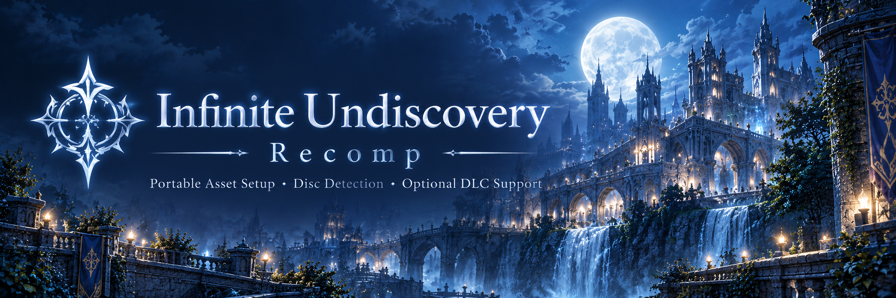

  

<h1 align="center">Infinite Undiscovery Recomp</h1>

  Native Windows x64 recompilation with portable asset setup.

The current build uses ReXGlue / XenonRecomp and includes a native setup wizard for importing game data from a legally obtained copy of the game.

No game files, DLC, ISOs or other copyrighted assets are distributed with this project.

## Download

The latest portable build is available from:

https://github.com/doc-haz/infinite-undiscovery-recomp/releases/latest

Extract the ZIP to a writable folder and run:

`InfiniteUndiscoveryRecomp.exe`

On first launch, the Asset Setup Wizard will ask for your game media and prepare the required files.

The Windows release is portable. No installer is required.

## System requirements

- Windows 10 or 11, 64-bit.
- A Direct3D 12 capable GPU. The runtime uses ReXGlue's `xenos` GPU plugin on
  top of D3D12 (`rexgpu-xenos.dll`).
- Microsoft Visual C++ Redistributable 2015-2022 (x64). The binaries depend on
  `MSVCP140.dll`, `MSVCP140_ATOMIC_WAIT.dll`, `VCRUNTIME140.dll` and
  `VCRUNTIME140_1.dll`. These Microsoft DLLs are **not** bundled with the
  release; install the redistributable if Windows reports a missing DLL.

## Current status

The recomp can currently:

- launch Infinite Undiscovery as a native Windows executable
- import supported USA, USA-UNDUB, EUROPE, JAPAN and ASIA game media
- detect Disc 1 and Disc 2 automatically
- read supported XDVDFS ISO images or extracted disc folders
- keep Disc 1 and Disc 2 assets separate
- validate known game revisions before installation
- import the supported A Voucher and B Voucher DLC packages
- install DLC through the ReXGlue content system
- keep saves, shaders, cache, logs and configuration local to the portable folder
- reuse an existing validated setup on later launches
- use English or Spanish in the setup UI
- official portable save editing companion available through IU Save Bridge

The current public release is still under active gameplay validation.

## Game files

You must provide your own legally obtained copy of Infinite Undiscovery.

For each disc, the setup system expects the required game data:

    default.xex
    ud1.bin
    ud2.bin

The wizard identifies the game from the media itself. Folder names are not used to determine region or disc number.

Supported content profiles:

- USA
- USA-UNDUB (Japanese voices, USA text)
- EUROPE
- JAPAN
- ASIA

Legacy folder names are migrated automatically on first launch: `NTSC-U` becomes
`USA` and `PAL` becomes `EUROPE`. All profiles may coexist in the same portable
directory without sharing assets or saves.

## Portable layout

Runtime data is stored relative to the directory containing the EXE.

Example:

    InfiniteUndiscoveryRecomp\
      InfiniteUndiscoveryRecomp.exe
      rexruntime.dll
      rexgpu-xenos.dll
      README.md
      LICENSE
      THIRD_PARTY_NOTICES.txt
      LICENSES\
      setup.json
      USA\                    (default profile; legacy NTSC-U migrates here)
        assets\disc1\
        assets\disc2\
        assets\dlc\
        saves\
        shaders\
        cache\
        logs\
        config.json
      USA-UNDUB\              (same layout as USA)
      EUROPE\                 (legacy PAL migrates here; same layout)
      JAPAN\                  (same layout)
      ASIA\                   (same layout)

Only the folders for profiles you actually configure are created. Every profile
folder keeps its own assets, saves, shaders, cache, logs and config.json, so
profiles never share state.

The recomp does not use Documents, AppData, Saved Games or previous development directories for normal runtime state.

Moving the complete portable folder moves the installation with it.

## Asset Setup Wizard

The Asset Setup Wizard is integrated into `InfiniteUndiscoveryRecomp.exe`.

Normal users do not need to run:

- Python extraction scripts
- BAT files
- PowerShell setup scripts
- `xdvdfs.py`
- `xex.py`
- external extraction utilities

The wizard handles:

1. Disc 1 selection and validation
2. optional Disc 2 selection
3. optional DLC selection
4. media verification
5. asset installation
6. portable configuration

Disc 1 is required.

Disc 2 setup is supported and recommended so the files are already available for future gameplay testing.

English is the default setup language. Spanish can be selected from the wizard.

## Multi-disc status

Infinite Undiscovery is a two-disc game.

The setup system can currently detect, validate and import both Disc 1 and Disc 2, and it keeps their assets separated correctly.

However, actual gameplay has not yet been tested up to the point where the original game requests Disc 2.

This means that Disc 2 asset preparation is validated, but the real in-game Disc 1 → Disc 2 transition is not.

At this time, it is not known how the current runtime will behave when the game reaches the disc-change point. It may work, require additional handling, or fail until explicit disc-switch support is implemented and tested.

Disc 2 can be prepared successfully, but successful in-game disc switching should not be assumed yet.

## DLC

Two Infinite Undiscovery Marketplace Content packages are currently supported:

- A Voucher
- B Voucher

Title ID:

    535107DB

The packages are validated before installation and remain separate.

DLC installation uses the ReXGlue content system rather than a custom content layout.

Already installed valid DLC is reused on later launches.

Different, damaged, incomplete or conflicting DLC is rejected instead of being silently overwritten.

The project does not distribute DLC packages.

## Saves

Save data is local to the portable installation.

Examples:

    USA\saves\
    EUROPE\saves\

Each content profile keeps its own saves; they do not share save data.

The project does not automatically import saves from older development builds, emulator directories or previous runtime locations.

This is intentional.

## Official Save Companion

**IU Save Bridge** is the official portable save editor companion for Infinite Undiscovery Recomp.

It is designed specifically for the portable save layout used by this recomp and supports both PAL and NTSC-U installations.

Repository:

https://github.com/doc-haz/iu-save-bridge

Latest release:

https://github.com/doc-haz/iu-save-bridge/releases/latest

Current features include:

- direct save editing
- Fol editing
- character stats editing
- inventory editing for 1,023 items
- automatic save discovery
- PAL / NTSC-U support
- automatic backups before writing
- manual backup support
- safe backup restore
- dual CRC32 recalculation
- English / Spanish interface
- fully portable operation
- no installer
- no AppData, Documents or Registry dependency

IU Save Bridge works directly with the portable save structure used by Infinite Undiscovery Recomp:

    USA\saves\
    EUROPE\saves\

The editor keeps its own backups and validates save data before replacing the active file.

Equipment, skills, story flags and other unverified save structures are intentionally not exposed for editing yet.

Download the current Windows x64 build from the IU Save Bridge Releases page.

## Validation

The current Asset Setup implementation has been tested with:

- USA Disc 1
- USA Disc 2
- EUROPE (PAL) Disc 1
- EUROPE (PAL) Disc 2
- USA-UNDUB media
- JAPAN media
- ASIA media
- profile detection and legacy NTSC-U / PAL migration
- Disc 1 / Disc 2 detection
- mixed-region rejection
- swapped-disc rejection
- invalid and truncated media
- modified XEX rejection
- foreign Title ID rejection
- A Voucher validation
- B Voucher validation
- duplicate DLC rejection
- corrupt DLC rejection
- foreign DLC rejection
- DLC installation through ReXGlue
- DLC reuse on subsequent launches
- conflicting installed DLC preservation
- setup cancellation and staging cleanup
- portable execution outside the development directory
- startup with a working directory different from the EXE directory

The automated setup tests are developer validation tools and do not replace a complete gameplay test.

## Known limitations

The following are still being validated:

- full-game completion
- gameplay progression up to the original Disc 2 change point
- actual in-game Disc 1 → Disc 2 transition behavior
- complete Disc 2 gameplay
- complete in-game verification of the A Voucher and B Voucher effects
- runtime issues that may only appear later in the game

Disc 2 can be imported successfully, but this does not mean the game has been proven to transition to Disc 2 correctly during gameplay.

No complete playthrough reaching the Disc 2 request has been performed yet.

Asset preparation does not imply full gameplay validation.

## Building from source

This repository does not include proprietary game assets or generated game code.

A developer build requires:

- a legally obtained supported Infinite Undiscovery executable
- ReXGlue SDK
- CMake
- Ninja
- Clang
- MSVC / Windows SDK environment

General build flow:

1. Clone the repository.
2. Provide the required ReXGlue toolchain and SDK.
3. Generate the game code locally from your own supported executable.
4. Configure the project with CMake.
5. Build the Windows x64 target.

The generated game code is intentionally excluded from the public repository.

More details about the setup implementation are available in:

`ASSET_SETUP.md`

Development history is documented in:

`PROJECT_HISTORY.md`

## Credits

This project builds on work from the Xbox 360 recompilation community.

Special thanks to:

- **Magna** — for major help with development, testing, portability, the Asset Setup Wizard, localization and preparing the portable build.
- **Premium** — for development help and support throughout the project.
- **[vs-sr-dev / pc-infiniteundiscovery](https://github.com/vs-sr-dev/pc-infiniteundiscovery)** — for extensive reverse-engineering research, documentation and analysis tools for Infinite Undiscovery and the ASKA engine.
- **[freefrank / LostOdysseyRecomp](https://github.com/freefrank/LostOdysseyRecomp)** — for the Lost Odyssey native PC recompilation project and its importer and portable workflow, which were useful references during development.
- **ReXGlue / XenonRecomp contributors** — for the tooling and groundwork that make projects like this possible.

## Legal

Infinite Undiscovery is property of its respective copyright holders.

This project is not affiliated with or endorsed by Square Enix, tri-Ace or Microsoft.

No copyrighted game files are included in this repository or in the release package.

You must provide your own legally obtained copy of the game and any optional DLC.

## License

The project code is licensed under the BSD-3-Clause license. See `LICENSE` for details.

Game files and external dependencies retain their respective rights and licenses. The project license does not grant any rights to those materials.
